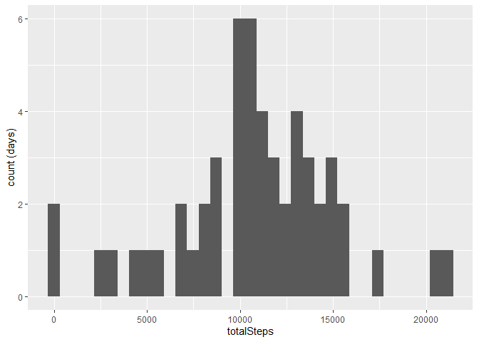
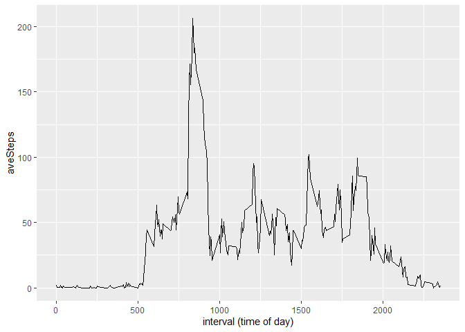
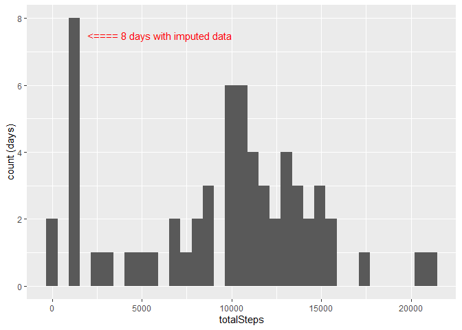
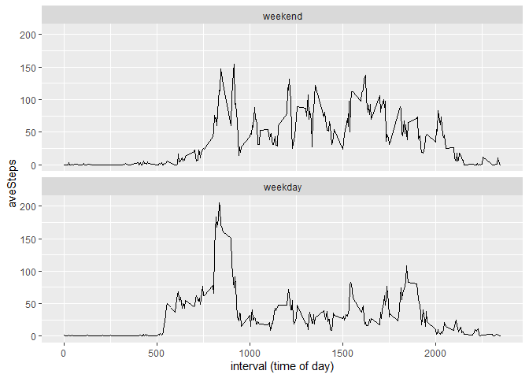

## Loading libraries and data


```r
library(tidyverse)
suppressWarnings(unzip("repdata_data_activity"))
activity <- read_csv("activity.csv")
```

```
## Rows: 17568 Columns: 3
```

```
## -- Column specification ------------------------------------------------------------
## Delimiter: ","
## dbl  (2): steps, interval
## date (1): date
```

```
## 
## i Use `spec()` to retrieve the full column specification for this data.
## i Specify the column types or set `show_col_types = FALSE` to quiet this message.
```
\
\
\
\
\

## What is mean total number of steps taken per day?


```r
temp <- activity %>%
      group_by(date) %>%
      summarise(totalSteps = sum(steps))
ggplot(temp, aes(totalSteps)) +
      geom_histogram(bins = 35, na.rm = TRUE) +
      labs(y = "count (days)")
```

<!-- -->

```r
temq <- tibble(meanSteps = mean(temp$totalSteps, na.rm = TRUE),
               medianSteps = median(temp$totalSteps, na.rm = TRUE))
knitr::kable(temq)
```


| meanSteps| medianSteps|
|---------:|-----------:|
|  10766.19|       10765|
**After calculating the total number of steps per day, plotted a histogram (specifying 35 bins) then found the mean and median values. Looking at the histogram, the most frequent values for steps per day fall around 10,000. The distribution appears more or less normal. There were several days where the monitor recorded few if any steps. The median value is 10765 steps per day and the mean is virtually identical.**
\
\
\
\
\

## What is the average daily activity pattern?


```r
temr <- activity %>%
      group_by(interval) %>%
      summarise(aveSteps = mean(steps, na.rm = TRUE))
ggplot(temr, aes(interval, aveSteps)) +
      geom_line() +
      labs(x = "interval (time of day)")
```

<!-- -->

```r
tems <- temr %>%
      arrange(desc(aveSteps))
knitr::kable(tems[1,])
```


| interval| aveSteps|
|--------:|--------:|
|      835| 206.1698|
**After calculating the average (mean) number of steps per interval (across all dates), constructed a scatter plot of average steps by interval. Interval represents time of day (from midnight to midnight) and has 288 values. Most activity occurs between 6am and 8pm, and intervals in this period typically show 25-75 steps. The interval at 8:35am has the highest average with 206 steps.**
\
\
\
\
\

## Imputing missing values


```r
knitr::kable(tibble(NAs = sum(is.na(activity$steps))))
```


|  NAs|
|----:|
| 2304|

```r
temt <- activity %>%
      group_by(interval) %>%
      summarise(medianSteps = median(steps, na.rm = TRUE))
temu <- inner_join(activity, temt, by = "interval")
temv <- temu
# replace NAs with median steps for that interval
temv$steps <- ifelse(is.na(temv$steps), temv$medianSteps, temv$steps)
temv <- temv %>%
      select(-medianSteps)
temw <- temv %>%
      group_by(date) %>%
      summarise(totalSteps = sum(steps))
ggplot(temw, aes(totalSteps)) +
      geom_histogram(bins = 35, na.rm = TRUE) +
      labs(y = "count (days)") +
      annotate("text", label = "<==== 8 days with imputed data",
               x = 6000, y = 7.5, size = 4, color = "red")
```

<!-- -->

```r
temx <- tibble(meanSteps = mean(temw$totalSteps, na.rm = TRUE),
               medianSteps = median(temw$totalSteps, na.rm = TRUE))
knitr::kable(temx)
```


| meanSteps| medianSteps|
|---------:|-----------:|
|  9503.869|       10395|
**Checking confirmed that there were no NAs for the step values in individual intervals for any of the dates. All 2304 NAs were for 8 days where no data was recorded for any of the 288 intervals in the day. So the median steps for each interval (across all dates with non-NA values) was imputed for the missing step value for the interval. Re-plotting the histogram for this "enhanced" dataset showed 8 additional days each with 1141 total steps (the sum of the step medians for the intervals). This was not at all useful.**
\
\
**Also, as would be expected, the "enhanced" dataset had lowered mean and median total step values, consistent with adding 8 days with total steps/day of 1141. Again, not useful.**
\
\
**Imputing missing step counts from the interval median (possibly adjusted for the total step count for the day) would make sense if there were intermittent NAs throughout the data. Since the NAs represented missing data for 8 entire days, it is more appropriate to simply drop those dates from the analysis.**
\
\
\
\
\

## Are there differences in activity patterns between weekdays and weekends?


```r
temy <- mutate(temv, dayType = character(length = nrow(temv)))
temy$dayType <- factor(ifelse(
      weekdays(temy$date) %in% c("Saturday", "Sunday"),
      "weekend", "weekday"),
      levels = c("weekend", "weekday"))
temz <- temy %>%
      group_by(interval, dayType) %>%
      summarise(aveSteps = mean(steps, na.rm = TRUE))
```

```
## `summarise()` has grouped output by 'interval'. You can override using the `.groups` argument.
```

```r
ggplot(temz, aes(interval, aveSteps)) +
      geom_line() +
      labs(x = "interval (time of day)") + 
      facet_wrap(vars(dayType), nrow = 2)
```

<!-- -->
\
**Using the date variable, constructed a factor, dayType, to differentiate  weekdays and weekends. Calculated the average (mean) number of steps per interval (across all dates), then constructed two scatter plots of average steps by interval, one for weekends and the other for weekdays. (Note: the "enhanced" dataset was used, per the instructions, but it would have been better to use the original dataset, dropping the 8 dates with no step data.)** 
\
\
**The pattern for weekdays is similar to that for the previous plot. (This makes sense because there are 2.5x more weekdays than weekend days.) Both weekdays and weekends show the highest activity level in the morning. Afternoon activity appears to be higher on the weekends than the weekdays.**

